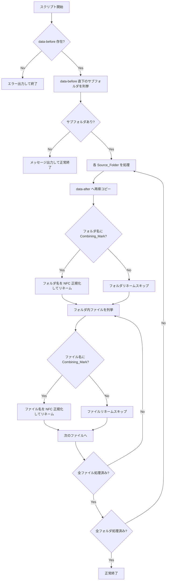

# 技術設計書: unicode-normalize-rename

## Overview

本スクリプトは `data-before` フォルダ内のサブフォルダおよびファイルを `data-after` フォルダへ再帰的にコピーし、コピー後のフォルダ名・ファイル名に含まれる結合濁点（U+3099）または結合半濁点（U+309A）を Unicode NFC 正規化によって合成済み文字へ変換する PowerShell スクリプトである。

macOS の HFS+ / APFS ファイルシステムは日本語ファイル名を NFD 形式（結合文字列）で保存するため、Windows 環境との間でファイル名の不一致が生じる。本スクリプトはその問題をバッチ処理で解消する。

### 処理フロー概要



---

## Architecture

スクリプトは単一の PowerShell ファイル（`.ps1`）として実装する。外部モジュールや依存ライブラリは使用しない。

### 設計方針

- **コピー優先**: 元データ（`data-before`）は一切変更しない。変換はコピー先（`data-after`）のみで行う。
- **冪等性**: 同一スクリプトを複数回実行しても、NFC 済みファイルは Combining_Mark を持たないためスキップされ、副作用が生じない。
- **.NET の `String.Normalize(NormalizationForm.FormC)` を利用**: PowerShell は .NET ランタイム上で動作するため、追加ライブラリなしで NFC 変換が可能。
- **エラー継続**: 個別フォルダ・ファイルのリネーム失敗（同名衝突など）はエラーログを出力してスキップし、残りの処理を継続する。
- **Shift-JIS エンコーディング**: `normalize-rename.ps1` および `tests/` 配下のすべての `.ps1` ファイルは Shift-JIS（コードページ 932）エンコーディングで保存する。これにより、Windows 環境での日本語コメント・文字列リテラルの文字化けを防ぐ。

### ファイル構成

```
<workspace>/
├── data-before/          # 入力フォルダ（変更しない）
│   └── <subfolder>/
│       └── <files>
├── data-after/           # 出力フォルダ（スクリプトが自動作成）
│   └── <subfolder-nfc>/
│       └── <files-nfc>
└── normalize-rename.ps1  # 本スクリプト
```

---

## Components and Interfaces

### 関数一覧

#### `Get-NfcName(name: string): string`

文字列を NFC 正規化して返す。

```
入力: 任意の文字列（NFD 形式を含む可能性あり）
出力: NFC 正規化済み文字列
```

#### `Test-HasCombiningMark(name: string): bool`

文字列に U+3099 または U+309A が含まれるか検査する。

```
入力: 任意の文字列
出力: $true（含む）/ $false（含まない）
```

#### `Copy-SourceFolder(sourcePath: string, destRoot: string): string`

Source_Folder を `data-after` へ再帰コピーし、コピー先パスを返す。

```
入力: sourcePath  - コピー元フォルダのフルパス
      destRoot    - data-after のフルパス
出力: コピー先フォルダのフルパス
副作用: destRoot が存在しない場合は自動作成
```

#### `Rename-ToNfc(itemPath: string): void`

フォルダまたはファイルを NFC 正規化した名前にリネームする。同名衝突時はエラーログを出力してスキップ。

```
入力: itemPath - リネーム対象のフルパス
副作用: ファイルシステム上のリネーム、コンソールへのログ出力
```

#### メインスクリプト本体

上記関数を呼び出し、要件に定義された処理フローを実行する。

---

## Data Models

PowerShell スクリプトのため、専用のクラス定義は持たない。処理中に使用するデータ構造を以下に示す。

### パス情報

| 変数名 | 型 | 説明 |
|---|---|---|
| `$sourceRoot` | `string` | `data-before` のフルパス |
| `$destRoot` | `string` | `data-after` のフルパス |
| `$sourceFolders` | `DirectoryInfo[]` | `data-before` 直下のサブフォルダ一覧 |

### 処理単位

| 変数名 | 型 | 説明 |
|---|---|---|
| `$folder` | `DirectoryInfo` | 処理中の Source_Folder |
| `$copiedFolderPath` | `string` | コピー先フォルダのフルパス |
| `$renamedFolderPath` | `string` | NFC リネーム後フォルダのフルパス |
| `$file` | `FileInfo` | 処理中のファイル |

### NFC 変換ロジック（.NET API）

```powershell
# NFC 正規化
$nfcName = $name.Normalize([System.Text.NormalizationForm]::FormC)

# Combining_Mark 検出（正規表現）
$hasMark = $name -match '[\u3099\u309A]'
```

---

## Correctness Properties

*A property is a characteristic or behavior that should hold true across all valid executions of a system — essentially, a formal statement about what the system should do. Properties serve as the bridge between human-readable specifications and machine-verifiable correctness guarantees.*


### Property 1: フォルダ列挙の完全性

*For any* `data-before` ディレクトリ内のサブフォルダ集合に対して、スクリプトが列挙するフォルダ集合はファイルシステム上の実際のサブフォルダ集合と等しくなければならない。

**Validates: Requirements 1.1**

---

### Property 2: コピーの完全性

*For any* フォルダ構造（任意のネスト深さ・ファイル数・ファイル名）を持つ `data-before` に対して、スクリプト実行後の `data-after` 内のファイルツリー（名前・内容）は `data-before` のそれと一致しなければならない。

**Validates: Requirements 2.1, 5.1**

---

### Property 3: 元データの不変性

*For any* フォルダ・ファイル構成を持つ `data-before` に対して、スクリプト実行前後で `data-before` 内のフォルダ名・ファイル名・ファイル内容は変化してはならない。

**Validates: Requirements 2.3**

---

### Property 4: Combining_Mark 検出の正確性

*For any* 文字列に対して、`Test-HasCombiningMark` 関数は U+3099 または U+309A を1文字以上含む場合に `$true` を返し、含まない場合に `$false` を返さなければならない。

**Validates: Requirements 3.1, 3.2**

---

### Property 5: NFC 変換の正確性と冪等性

*For any* 文字列（Combining_Mark を含む・含まないを問わず）に対して、`Get-NfcName` 関数は以下の2つの性質を満たさなければならない。

1. **Combining_Mark 除去**: 変換後の文字列に U+3099 および U+309A が含まれない。
2. **冪等性**: `Get-NfcName(Get-NfcName(x)) = Get-NfcName(x)` が成立する。

**Validates: Requirements 4.1, 4.2, 5.2, 5.3**

---

### Property 6: 処理ログの完全性

*For any* コピーまたはリネームが行われたフォルダ・ファイルに対して、スクリプトのコンソール出力にはコピー元パスとコピー先パス（コピー時）、またはリネーム前の名前とリネーム後の名前（リネーム時）が含まれなければならない。

**Validates: Requirements 6.1, 6.2**

---

## Error Handling

| 状況 | 対応 |
|---|---|
| `data-before` が存在しない | エラーメッセージを出力し `exit 1` で終了 |
| `data-before` 直下にサブフォルダがない | 情報メッセージを出力し `exit 0` で正常終了 |
| `data-after` が存在しない | `New-Item -ItemType Directory` で自動作成 |
| NFC 済み同名フォルダが既に存在する | エラーメッセージを出力してそのフォルダをスキップ、処理継続 |
| NFC 済み同名ファイルが既に存在する | エラーメッセージを出力してそのファイルをスキップ、処理継続 |
| `Rename-Item` が例外をスローした場合 | `try/catch` でキャッチしエラーメッセージを出力、処理継続 |

エラーが発生した場合でも、他のフォルダ・ファイルの処理は継続する（フェイルソフト設計）。

---

## Testing Strategy

### 対象言語・ツール

- 言語: PowerShell 7+（`pwsh`）
- プロパティベーステストライブラリ: [Pester](https://pester.dev/)（PowerShell 標準のテストフレームワーク）+ カスタムジェネレータ関数
  - PowerShell には fast-check や QuickCheck 相当の成熟したライブラリが存在しないため、Pester のテスト内でランダム入力を生成するヘルパー関数を実装してプロパティテストを実現する。
  - 各プロパティテストは最低 100 イテレーション実行する。

### テスト構成

```
tests/
├── unit/
│   ├── Get-NfcName.Tests.ps1          # Property 5
│   ├── Test-HasCombiningMark.Tests.ps1 # Property 4
│   └── helpers/
│       └── Generators.ps1             # ランダム入力生成ヘルパー
└── integration/
    ├── Copy.Tests.ps1                 # Property 2, 3
    ├── Enumerate.Tests.ps1            # Property 1
    ├── Logging.Tests.ps1              # Property 6
    └── ErrorCases.Tests.ps1           # 例示テスト（1.2, 1.3, 4.3, 5.4, 6.3）
```

### ユニットテスト（プロパティテスト）

各プロパティテストは Pester の `It` ブロック内でループを回し、ランダム入力を生成して検証する。

```powershell
# タグ形式: Feature: unicode-normalize-rename, Property N: <property_text>
It "Property 5: NFC変換の正確性と冪等性" -Tag "Feature: unicode-normalize-rename, Property 5: NFC変換の正確性と冪等性" {
    1..100 | ForEach-Object {
        $input = New-RandomStringWithCombiningMarks
        $result = Get-NfcName $input
        # Combining_Mark が除去されていること
        $result | Should -Not -Match '[\u3099\u309A]'
        # 冪等性
        (Get-NfcName $result) | Should -Be $result
    }
}
```

### 統合テスト（例示テスト）

実際の一時ディレクトリを作成・削除しながら、スクリプト全体の動作を検証する。

- `data-before` 不在時のエラー終了（要件 1.2）
- 空フォルダ時の正常終了（要件 1.3）
- 同名衝突時のスキップ（要件 4.3, 5.4）
- スキップ理由のログ出力（要件 6.3）

### テスト実行コマンド

```powershell
# 全テスト実行（単発）
Invoke-Pester -Path ./tests -Output Detailed
```

### エンコーディングに関する注記

`tests/` 配下のすべての `.ps1` ファイル（テストファイルおよびヘルパーファイル）は、`normalize-rename.ps1` と同様に **Shift-JIS（コードページ 932）** エンコーディングで保存すること。エディタやスクリプトでファイルを新規作成・編集する際は、保存時のエンコーディング設定を確認すること。

### プロパティテストの設定

- 最低イテレーション数: **100 回**
- ランダムシード: テスト失敗時の再現性のため、失敗したシードをログに出力する
- タグ形式: `Feature: unicode-normalize-rename, Property {N}: {property_text}`
